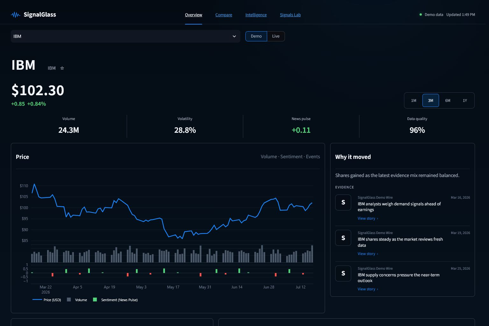
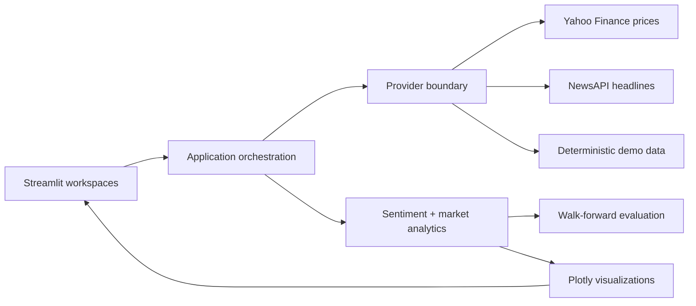

# SignalGlass



[](https://github.com/TarunT27/MarketWatch-Insights-Dashboard/actions/workflows/ci.yml)


SignalGlass is an explainable market-intelligence cockpit built for fast, evidence-led research. It combines Yahoo Finance price history, financial headlines, sentiment features, and an honest walk-forward signal evaluation in a polished, responsive Streamlit application.

The default experience is deterministic and works immediately. Switch to **Live** to load current Yahoo Finance prices without an API key. A NewsAPI key is optional; without one, the app keeps the live prices and clearly labels the accompanying headlines as demo data.

> Research prototype. Not financial advice.

## What makes it portfolio-ready

- **Apple-inspired product UI** — true-neutral graphite surfaces, cobalt interaction states, restrained glass, responsive layouts, and a focused information hierarchy.
- **Explainable evidence** — the “Why it moved” panel keeps every narrative grounded in visible source headlines.
- **Four complete workspaces** — Overview, Compare, Intelligence, and Signals Lab are functional routes rather than decorative tabs.
- **Any Yahoo-compatible symbol** — type a stock, ETF, index, or crypto ticker directly into the searchable picker; recent symbols stay one click away.
- **No-key live prices** — Yahoo Finance data is accessed through `yfinance`; no Yahoo API key is required.
- **Honest modeling** — chronological walk-forward validation avoids look-ahead leakage and reports directional accuracy and mean absolute error.
- **Resilient data provenance** — price and news sources are tracked independently, so a missing or failed news provider cannot silently mislabel the experience.
- **Recruiter-friendly setup** — deterministic demo data, pinned dependencies, CI, linting, automated tests, and 80% coverage enforcement.

## Product tour

| Workspace | Purpose |
| --- | --- |
| **Overview** | Price, volume, sentiment pulse, data quality, watchlist, and evidence for the latest move. |
| **Compare** | Normalized relative performance and a compact cross-company snapshot. |
| **Intelligence** | Auditable headline stream, tone distribution, source coverage, and a sourced market narrative. |
| **Signals Lab** | Feature contributions, methodology, limitations, and an interactive walk-forward evaluation. |

The picker starts with popular symbols such as AAPL, MSFT, NVDA, and TSLA, but accepts any validated Yahoo Finance-compatible ticker—for example AMD, SPY, BRK.B, `^GSPC`, or BTC-USD. The interface adapts from a dense desktop cockpit to a single-column mobile view.

## Quick start

```bash
git clone https://github.com/TarunT27/MarketWatch-Insights-Dashboard.git
cd MarketWatch-Insights-Dashboard
python -m venv .venv
```

Activate the environment and install dependencies:

```bash
# macOS / Linux
source .venv/bin/activate

# Windows PowerShell
.venv\Scripts\Activate.ps1

pip install -r requirements.txt
streamlit run app.py
```

Open [http://localhost:8501](http://localhost:8501). The app starts in Demo mode, so no credentials are needed.

Use the first control as a searchable ticker picker. Choose a suggested symbol or type a new one and press Enter. Shareable URLs can also seed a symbol, for example `?page=Overview&symbol=AMD`.

## Live data configuration

Yahoo Finance prices are keyless. To add live financial headlines, copy the example secrets file and provide a NewsAPI key:

```bash
cp .streamlit/secrets.toml.example .streamlit/secrets.toml
```

```toml
newsapi_key = "your-newsapi-key"
```

You can also set `NEWSAPI_KEY` in the environment. To make Live the initial selection, set:

```bash
SIGNALGLASS_DATA_MODE=live
```

If NewsAPI is unavailable, SignalGlass continues with live Yahoo prices plus clearly identified demo headlines. Secrets are never committed.

## Architecture



```text
app.py                    Application entry point and routing
signalglass/providers.py  Live/demo provider orchestration and provenance
signalglass/analytics.py  Sentiment aggregation, feature engineering, evaluation
signalglass/charts.py     Consistent Plotly chart builders
signalglass/theme.py      Design tokens and responsive Streamlit styling
signalglass/ui/           Feature-focused workspace renderers
tests/                    Unit and integration-style app tests
```

External data is normalized at the provider boundary. UI modules consume a stable `MarketBundle`, while analytics operate on validated pandas data frames. This keeps demo, partial-live, and fully live modes predictable.

## Quality gates

```bash
pip install -r requirements-dev.txt
python -m ruff check .
python -m ruff format --check .
python -m pytest --cov=signalglass --cov-report=term-missing --cov-fail-under=80
```

The current suite covers provider fallbacks, validation, data alignment, charts, chronological evaluation, and app smoke behavior. GitHub Actions runs lint and coverage checks for every push and pull request.

## Design assets

The repository includes the visual exploration used to guide the implementation:

- `assets/concepts/signalglass-overview-desktop.png`
- `assets/concepts/signalglass-overview-mobile.png`
- `assets/concepts/signalglass-signals-lab.png`
- `assets/brand/signalglass-app-icon.png`

## Data and modeling notes

- Yahoo Finance access is provided through `yfinance` and is intended for personal, research, and educational use subject to the upstream terms.
- Demo prices and headlines are synthetic and labeled in the product.
- Headline sentiment is a lightweight research feature, not a statement of fact or a trading recommendation.
- Evaluation is chronological and out of sample, but historical performance does not imply future results.

## Responsible use

SignalGlass is an engineering and product-design demonstration. It is not investment advice, does not execute trades, and should not be used as the sole basis for financial decisions.
